# comp4971c

Multiple Model-based Binary Classification for Forex Trading

Author - myworldbox

## Swing Trading

---- Accuracy

----- Report
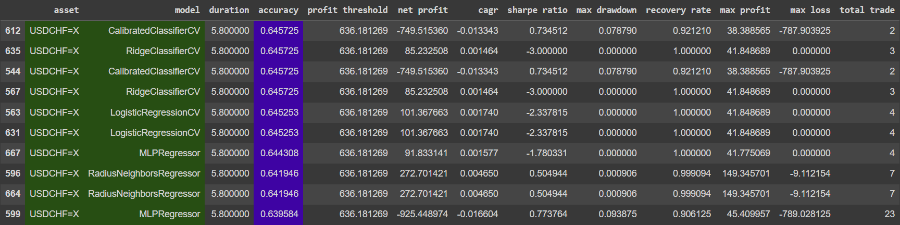

----- Graph
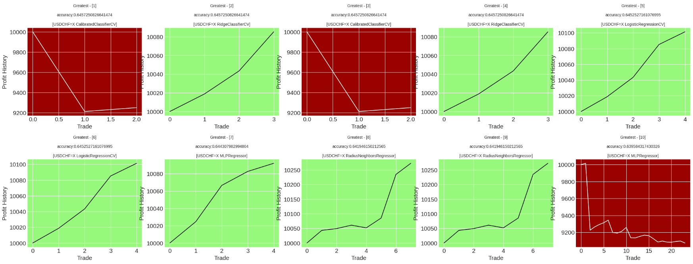

---- Sharpe Ratio

----- Report
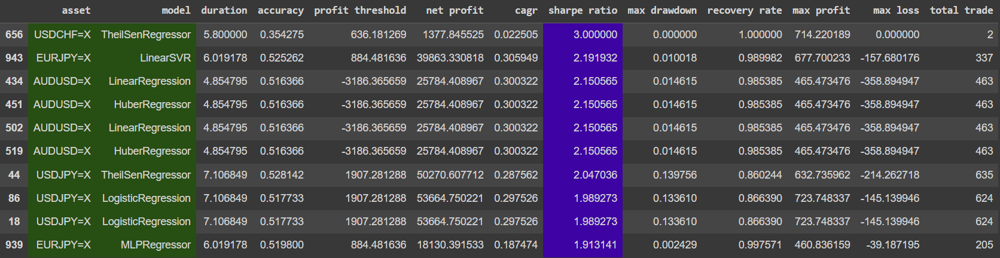

----- Graph
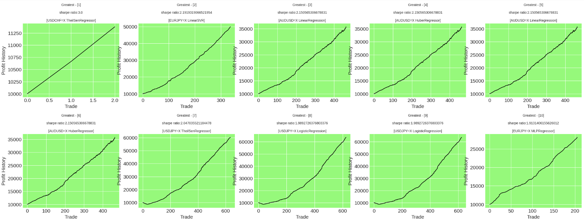

---- Compounded Annual Growth Rate

----- Report
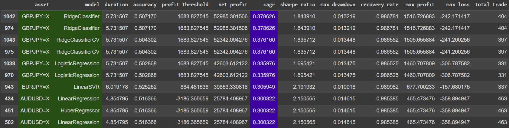

----- Graph
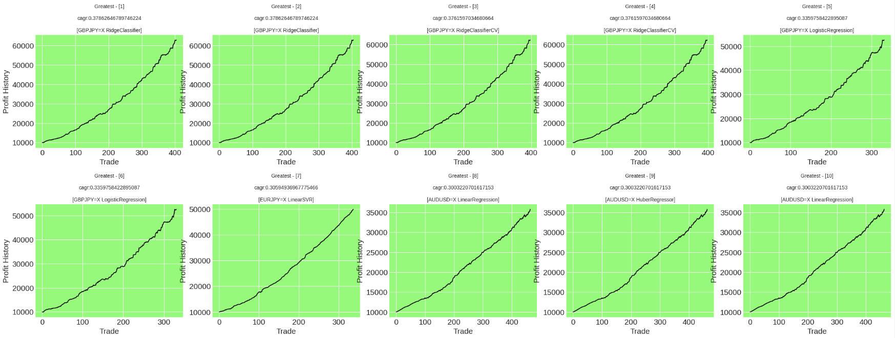

---- Maximum Drawdown

----- Report
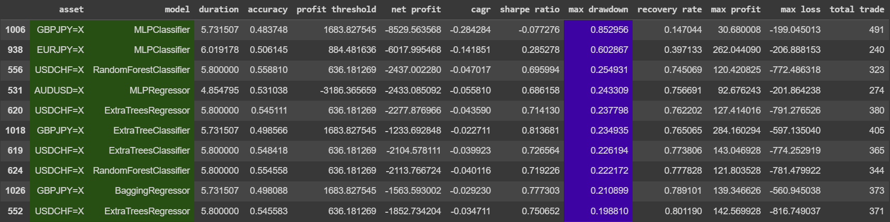

----- Graph

## Day Trading

---- Accuracy

----- Report
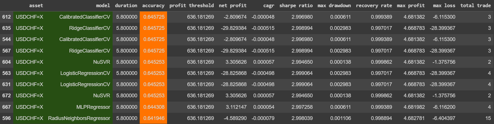

----- Graph
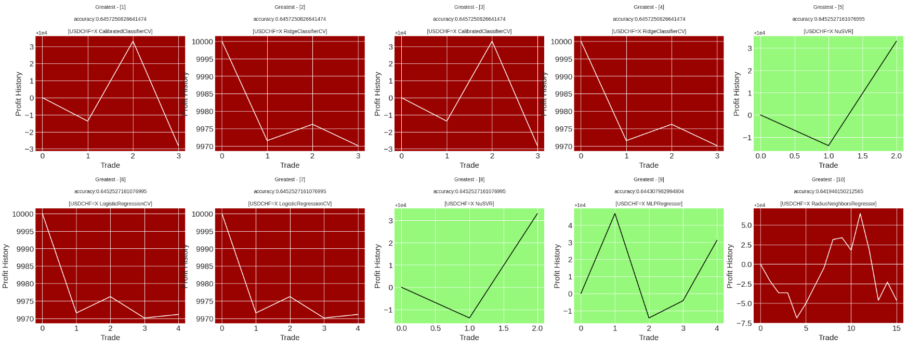

---- Sharpe Ratio

----- Report
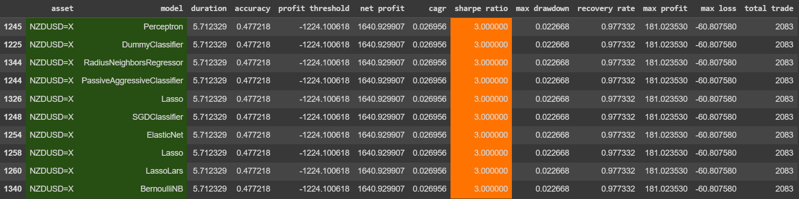

----- Graph
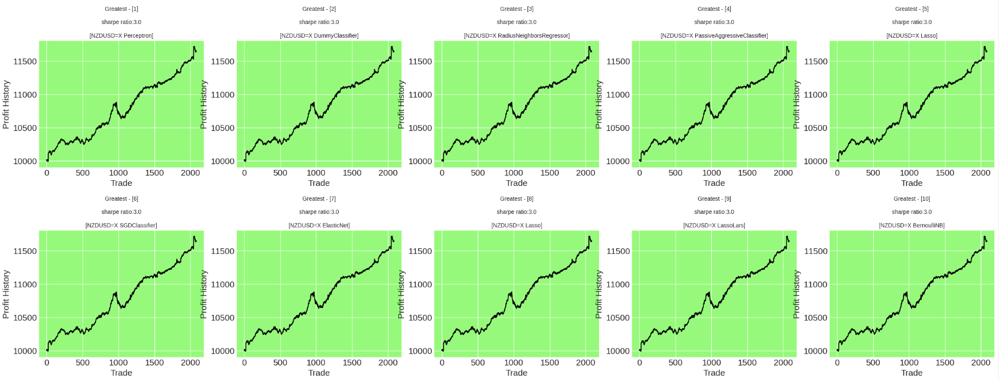

---- Compounded Annual Growth Rate

----- Report
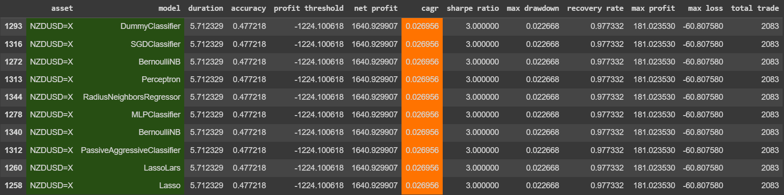

----- Graph
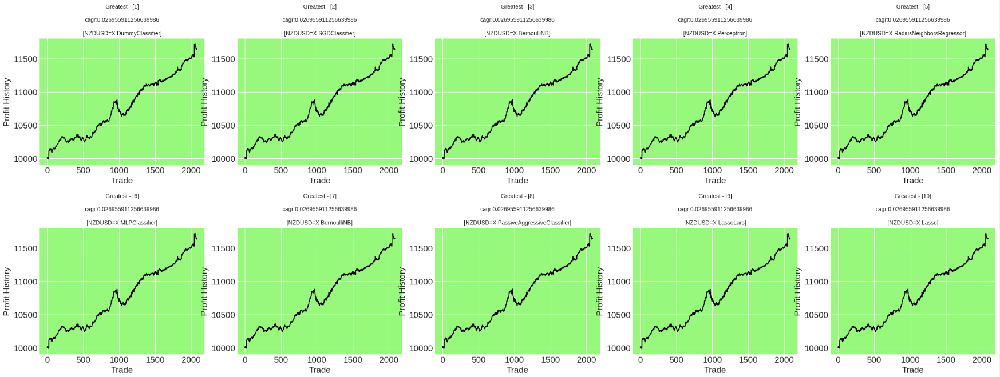

---- Maximum Drawdown

----- Report
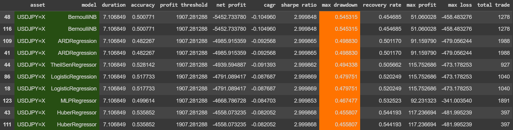

----- Graph
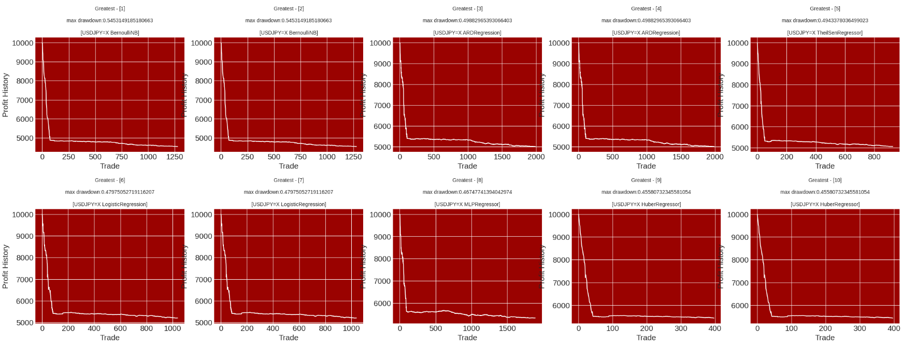