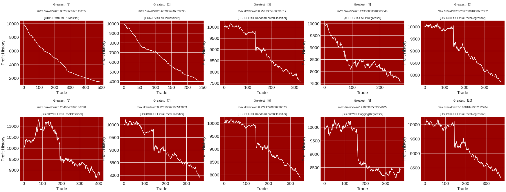

# comp4971c

Author - myworldbox

# Multiple Model-based Binary Classification for Forex Trading

# Swing Trading

## Accuracy

### Report

### Graph

## Compounded Annual Growth Rate

### Report

### Graph

## Maximum Drawdown

### Report

### Graph

# Day Trading

## Accuracy

### Report

### Graph

## Compounded Annual Growth Rate

### Report

### Graph

## Maximum Drawdown

### Report

### Graph
